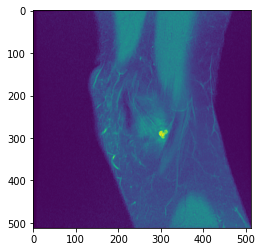

# Intelligent Imaging Tools and Tasks (I2T2) 
> Library of useful tools for Medical Imaging Handling


Instructions for installation and usage can be found below.

## Install

`pip install I2T2`

## How to use

```python
# example usage:
from I2T2.data.manipulate import *
import matplotlib.pyplot as plt

data_path = '../data/knee/'
try:
    array = dcm2array(path_to_dicom_dir = data_path, sort_by_slice_location=True)
    plt.imshow(array[:,:,0])
    plt.show()
except:
    print('could not load array')    
```





`dcm2array` uses pydicom to load the data from DICOM files. If DICOM are compressed, GDCM is used.

Make sure to have GDCM installed in your conda environment via `conda install -c conda-forge gdcm`

```python
#test
try:
    import gdcm
    print('Successfully imported GDCM')
except ImportError:
    print('Could not import GDCM')
```

    Successfully imported GDCM

