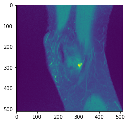

# Intelligent Imaging Tools and Tasks (I2T2) 
> Library of useful tools for Medical Imaging Handling


Instructions for installation and usage examples can be found below.

## Install

It's highly recommended you install `I2T2` and its dependencies in a virtual environment (conda or others), so that you don't interfere with system-wide python packages.

There are two ways of installing I2T2 and its dependencies:

1. Using `pip`:

```python
conda create -n I2T2 python=3.7
conda activate I2T2
pip install I2T2
conda install -c conda-forge gdcm
```

2. Via github download:

```python
git clone https://github.com/UCSF-intelligent-imaging/I2T2/
cd I2T2/
conda env create -f environment.yml
```

## Test your installation

```python
conda activate I2T2
python
>>> import I2T2
```

`I2T2` uses GDCM to uncompress some DICOMs.

Make sure to have GDCM installed in your conda environment via `conda install -c conda-forge gdcm`

```python
conda activate I2T2
python
>>> import gdcm
```

## Using I2T2

```
# example usage:
from I2T2.data.manipulate import *
import matplotlib.pyplot as plt

data_path = '../data/knee/'
try:
    array = dcm2array(path_to_dicom_dir = data_path, sort_by_slice_location=True)
    plt.imshow(array[:,:,0])
    plt.show()
except:
    print('could not load array')    
```




